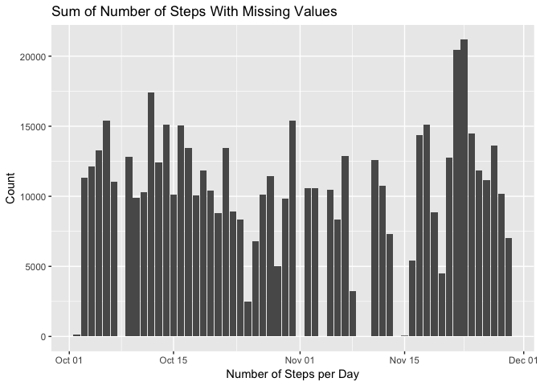
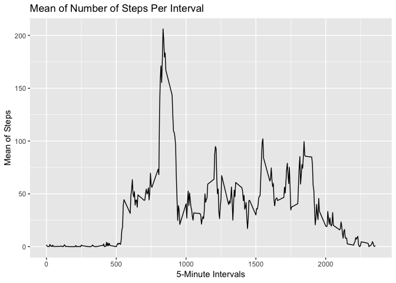
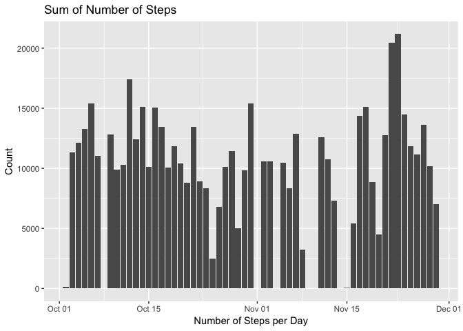
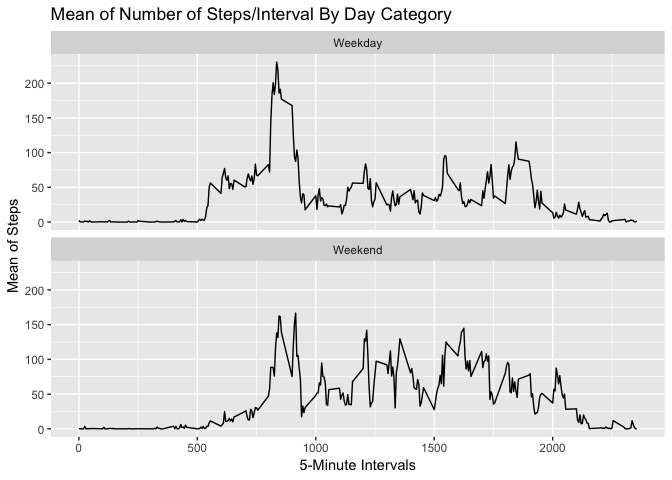

Packages
========

You need to install and load these packages

``` r
# install packages
# install.packages("ggplot2")
# install.packages("dplyr")

# load packages
library(ggplot2)
library(dplyr)
```

    ## Warning: package 'dplyr' was built under R version 3.5.2

    ## 
    ## Attaching package: 'dplyr'

    ## The following objects are masked from 'package:stats':
    ## 
    ##     filter, lag

    ## The following objects are masked from 'package:base':
    ## 
    ##     intersect, setdiff, setequal, union

Loading the data
================

The data for this assignment can be downloaded from [here](https://d396qusza40orc.cloudfront.net/repdata%2Fdata%2Factivity.zip).

After you download the file, locate it in the same directory as your R or RStudio and run the following code:

``` r
data <- read.csv("activity.csv")
head(data)
```

    ##   steps       date interval
    ## 1    NA 2012-10-01        0
    ## 2    NA 2012-10-01        5
    ## 3    NA 2012-10-01       10
    ## 4    NA 2012-10-01       15
    ## 5    NA 2012-10-01       20
    ## 6    NA 2012-10-01       25

``` r
str(data)
```

    ## 'data.frame':    17568 obs. of  3 variables:
    ##  $ steps   : int  NA NA NA NA NA NA NA NA NA NA ...
    ##  $ date    : Factor w/ 61 levels "2012-10-01","2012-10-02",..: 1 1 1 1 1 1 1 1 1 1 ...
    ##  $ interval: int  0 5 10 15 20 25 30 35 40 45 ...

Processing the data
===================

``` r
data$DateTime <- as.POSIXct(data$date, format="%Y-%m-%d")
str(data)
```

    ## 'data.frame':    17568 obs. of  4 variables:
    ##  $ steps   : int  NA NA NA NA NA NA NA NA NA NA ...
    ##  $ date    : Factor w/ 61 levels "2012-10-01","2012-10-02",..: 1 1 1 1 1 1 1 1 1 1 ...
    ##  $ interval: int  0 5 10 15 20 25 30 35 40 45 ...
    ##  $ DateTime: POSIXct, format: "2012-10-01" "2012-10-01" ...

Questions
=========

What is the mean total number of steps per day?
-----------------------------------------------

``` r
sum_per_day <- aggregate(data = data,
                          steps ~ DateTime,
                          FUN = sum,
                          na.rm = F)
colnames(sum_per_day) <- c("date", "steps")
ggplot(sum_per_day, aes(x=date, y=steps)) +
  geom_histogram(stat = "identity")+
  xlab("Number of Steps per Day")+
  ylab("Count")+
  ggtitle("Sum of Number of Steps")
```

    ## Warning: Ignoring unknown parameters: binwidth, bins, pad



``` r
mean_per_day <- as.integer(mean(sum_per_day$steps))
medi_per_day <- median(sum_per_day$steps)
```

As you see, the mean and median of total number of teps taken per day are 10766 and 10765, respectively.

What is the mean total number of steps per day?
-----------------------------------------------

``` r
mean_interval <- aggregate(data = data,
                           steps ~ interval,
                           FUN = mean,
                           na.rm = T)
colnames(mean_interval) <- c("interval", "steps")
ggplot(mean_interval, aes(x=interval, y=steps))+
  geom_line()+
  xlab("5-Minute Intervals")+
  ylab("Mean of Steps")+
  ggtitle("Mean of Number of Steps Per Interval")
```



``` r
max_interval <- mean_interval[mean_interval$steps >= max(mean_interval$steps),]$interval
```

As you see, interval 835 has the maximum number of steps on average.

Imputing Missing Values
-----------------------

``` r
#Number of Missing Rows
sum_missing <- sum(is.na(data$steps))
```

The total number of rows with missing steps is 2304.

Imputing missing data with average mean of the same intervel in the data.

``` r
data["isna"] = 0
data[is.na(data$steps),"isna"] = 1
cdata <- data[!is.na(data$steps),]
nadata <- data[is.na(data$steps),]
imp <- left_join(x = nadata[,2:5],
     y = mean_interval,
     by = c("interval"="interval"))
clean_data <- rbind(cdata, imp)
sum_missing_2 <- sum(is.na(clean_data$steps))
```

Now, the total number of rows with steps is 0.

``` r
sum_per_day_cleaned <- aggregate(data = clean_data,
                          steps ~ DateTime,
                          FUN = sum)
colnames(sum_per_day_cleaned) <- c("date", "steps")
ggplot(sum_per_day, aes(x=date, y=steps)) +
  geom_histogram(stat = "identity")+
  xlab("Number of Steps per Day")+
  ylab("Count")+
  ggtitle("Sum of Number of Steps")
```

    ## Warning: Ignoring unknown parameters: binwidth, bins, pad



``` r
mean_per_day_cleaned <- as.integer(mean(sum_per_day_cleaned$steps))
medi_per_day_cleaned <- as.integer(median(sum_per_day_cleaned$steps))
```

As you see, the mean and median of total number of teps taken per day are 10766 and 10766, respectively. According to these number, the mean and the median did not change from the frist try with missing values. The main impact of imputing missing values is now there are a few dates which have similar pattern and and the value of each interval is the same as mean for that interval.

### Weekdays vs Weekends

``` r
clean_data$day <- weekdays(clean_data$DateTime)
clean_data$Day_Category <- ifelse(clean_data$day %in% c("Saturday", "Sunday"), "Weekend", "Weekday")
```

``` r
mean_interval_week <- aggregate(data = clean_data,
                           steps ~ interval+Day_Category,
                           FUN = mean,
                           na.rm = T)
ggplot(mean_interval_week, aes(x=interval, y=steps))+
  geom_line()+
  facet_wrap(~Day_Category,nrow = 2)+
  xlab("5-Minute Intervals")+
  ylab("Mean of Steps")+
  ggtitle("Mean of Number of Steps/Interval By Day Category")
```



Yes, The pattern has an obvious difference in the mornings and noon. Over the weekdays the mean of number of steps are higher than the weekends. On the other hand, this average is higher near the noon for the weekends.
